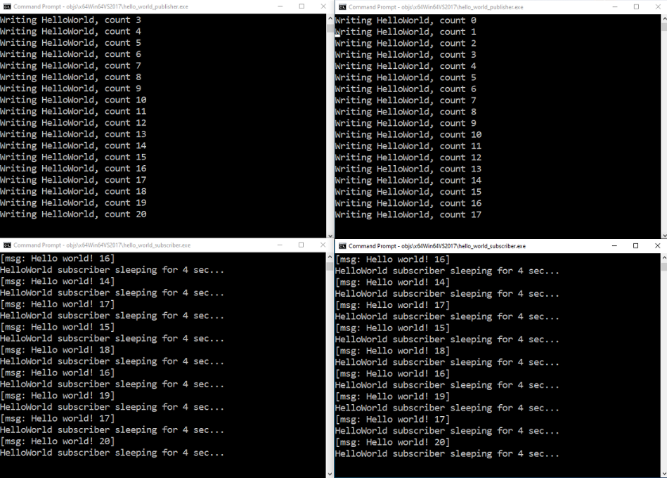

# rticonnextdds-getting-started

### 1. File Tree

You should download this project on your own in section B2.

    .
    └── 2_hello_world
        │  hello_world.idl
        ├─c++11
        │      application.hpp
        │      hello_world_publisher.cxx
        │      hello_world_subscriber.cxx
        │      USER_QOS_PROFILES.xml
        ├─c++98
        ├─csharp
        └─python

### 2. Environment and Start

1. OS: Windows 10/11

2. IDE: Visual Studio **2017** (with `Windows 10 SDK 10.0.17134.0`)

3. Fill in the form at [Try Connext for Free](https://www.rti.com/free-trial). Download the `.exe` file.

4. Follow the instructions at [Installing an Evaluation or LM Version](https://community.rti.com/static/documentation/connext-dds/7.2.0/doc/manuals/connext_dds_professional/installation_guide/installation_guide/Installing.htm#1.2_Installing_an_Evaluation_or_LM_Version).

   - Run the `.exe` file downloaded.

5. (Follow the instructions at [2.2. Hands-On 1: Your First DataWriter and DataReader](https://community.rti.com/static/documentation/connext-dds/7.2.0/doc/manuals/connext_dds_professional/getting_started_guide/cpp11/intro_pubsub_cpp.html#hands-on-1-your-first-datawriter-and-datareader)) Open a command prompt window. Run command `<installdir>\resource\scripts\rtisetenv_<architecture>.bat`. For example: `C:\Program Files\rti_connext_dds-<version>\resource\scripts\rtisetenv_x64Win64VS2017.bat`.

6. Inside the repository you have cloned, there is a directory named `2_hello_world`, which contains the **HelloWorld** type definition in a file named `hello_world.idl`. You can run following commands:

   ```
   cd 2_hello_world
   rtiddsgen -language c++11 -platform <architecture> -create makefiles -create typefiles -d c++11 -ppDisable hello_world.idl
   ```

7. Open the `c++11` directory to review the code.

8. In the `2_hello_world/c++11` directory, open `hello_world_publisher.cxx` in your IDE of choice.

9. Change the *Topic* name from “Example HelloWorld” to “HelloWorld Topic”:

   ```c++
   // A Topic has a name and a datatype. Create a Topic named
   // "HelloWorld Topic" with type HelloWorld
   dds::topic::Topic<HelloWorld> topic(participant, "HelloWorld Topic");
   ```

10. Modify the code to send the message “Hello world!” with a count. In the **for** loop in the snippet, add the highlighted line, just after the comment `// Modify the data to be written here`. This will set **sample.msg** to “Hello world!” with a count:

    ```C++
    // Create data sample for writing
    HelloWorld sample;
    for (int count = 0; running && (count < sample_count || sample_count == 0);
         count++) {
        // Modify the data to be written here
        sample.msg("Hello world! " + std::to_string(count));
    
        std::cout << "Writing HelloWorld, count " << count << std::endl;
    
        writer.write(sample);
    
        rti::util::sleep(dds::core::Duration(4));
    }
    ```

11. Open `hello_world_subscriber.cxx`. Change the *Topic* name from “Example HelloWorld” to “HelloWorld Topic”, just as you did in the publishing application.

    ```c++
    // A Topic has a name and a datatype. Create a Topic named
    // "HelloWorld Topic" with type HelloWorld
    dds::topic::Topic<HelloWorld> topic(participant, "HelloWorld Topic");
    ```

12. Launch Visual Studio by typing hello_world-x64Win64VS2017.sln in the Command Prompt window.

13. Select Build Solution from the Build menu. (You can also right-click `hello_world_publisher` or `hello_world_subscriber` and choose `Build`; do for each.)

14. Make sure you have run `rtisetenv_<architecture>` in any new command prompt window, to avoid issues with paths and licensing. From within the `2_hello_world/c++11` directory, enter the following full path using the **SAME** command prompt window:

    ```bash
    objs\<architecture>\hello_world_publisher.exe
    ```

15. Open another command prompt window, run `rtisetenv_<architecture>` if you haven’t already in that window, and from within the `2_hello_world/c++11` directory, enter the following full path:

    ```
    objs\<architecture>\hello_world_subscriber.exe
    ```

16. You should see this in the window:

    ```
    Writing HelloWorld, count 0
    ...
    ---
    HelloWorld subscriber sleeping for 4 sec...
    [msg: Hello world! 1]
    ...
    ```

    Succeed!

    

# FastDDS & RTI Connext DDS

Note: FastDDS and RTI Connext DDS use the same structure in the `.idl` file to generate their own codes, and use the same topic; you can open `Publisher` in one DDS and `Subscriber` in another DDS (as long as the DDS of both manufacturers comply with OMG's communication specifications, they could work together under the DSCP model).

